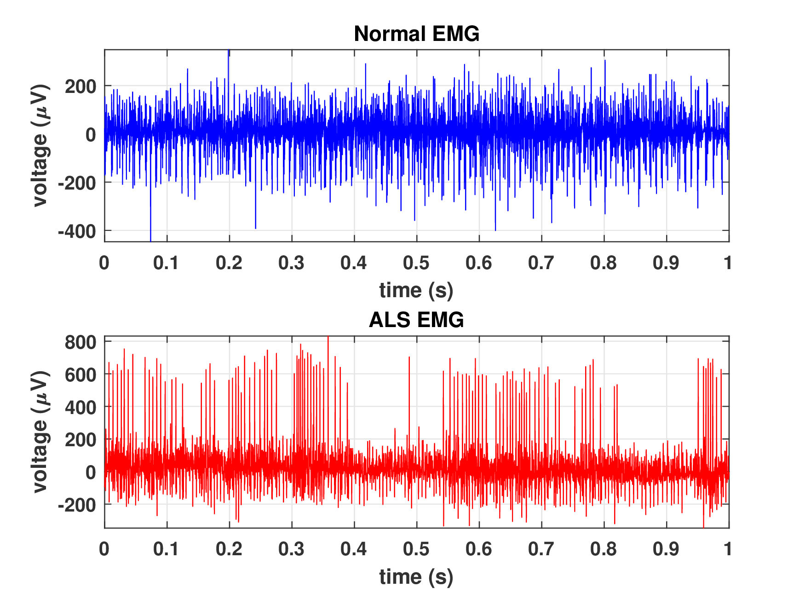

# ALSNet: A DILATED 1-D CNN FOR IDENTIFYING ALS FROM RAW EMG SIGNAL
Official repository for ALSNet, ICASSP 2022

## [Paper][alsnet] || [Video][video]

[alsnet]: https://naimulhassan.github.io/content/papers/alsnet.pdf
[video]: https://youtu.be/iRa5x84tl6A

[][code]

[code]: https://www.kaggle.com/datasets/naimulhassan/processed-emglab-dataset-for-als-detection

          
          
</td>

Abstract: <i>Amyotrophic Lateral Sclerosis (ALS) is one of the most common neuromuscular diseases which affects both lower and upper motor neurons. In this paper, a dilated one dimensional convolutional neural network, named ALSNet, is proposed for identifying ALS from raw EMG signal. No hand-crafted feature extraction is required, rather, ALSNet is able to take raw EMG signal as input and detect EMG signals of ALS subjects. This makes the method more feasible for practical implementation by reducing the computational cost required for extracting features. To our best knowledge, no research work for identification of ALS from raw EMG signal has been conducted yet. The performance of the ALSNet was evaluated using popular metrics such as overall accuracy, sensitivity, specificity and balanced accuracy and compared with other existing methods. The proposed method showed a better performance than the other existing methods with an overall accuracy of 97.74%.</i>

## Citation
@INPROCEEDINGS{9747366, 
author={Naimul Hassan, K. M. and Shamiul Alam Hridoy, Md. and Tasnim, Naima and Chowdhury, Atia Faria and Alam Roni, Tanvir and Tabrez, Sheikh and Subhana, Arik and Shahnaz, Celia}, 
booktitle={ICASSP 2022 - 2022 IEEE International Conference on Acoustics, Speech and Signal Processing (ICASSP)}, 
title={ALSNet: A Dilated 1-D CNN for Identifying ALS from Raw EMG Signal}, 
year={2022}, 
volume={}, 
number={}, 
pages={1181-1185}, 
doi={10.1109/ICASSP43922.2022.9747366}}